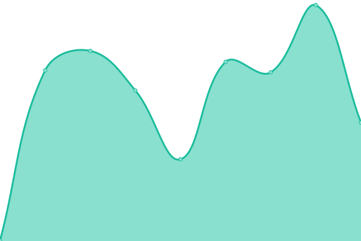
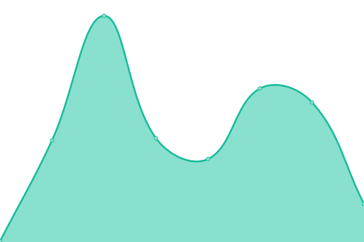
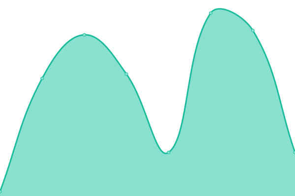
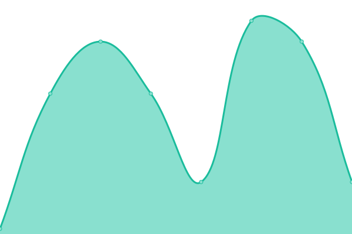
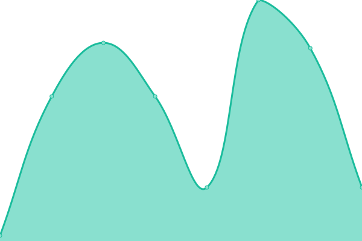

# [📈 Live Status](https://BradGunnerSGT.github.io/upptime): <!--live status--> **🟩 All systems operational**

This repository contains the open-source uptime monitor and status page for [Mark McCoy](markmccoy.us), powered by [Upptime](https://github.com/upptime/upptime).

With [Upptime](https://upptime.js.org), you can get your own unlimited and free uptime monitor and status page, powered entirely by a GitHub repository. We use [Issues](https://github.com/BradGunnerSGT/upptime/issues) as incident reports, [Actions](https://github.com/BradGunnerSGT/upptime/actions) as uptime monitors, and [Pages](https://BradGunnerSGT.github.io/upptime) for the status page.

<!--start: status pages-->
<!-- This summary is generated by Upptime (https://github.com/upptime/upptime) -->
<!-- Do not edit this manually, your changes will be overwritten -->
<!-- prettier-ignore -->
| URL | Status | History | Response Time | Uptime |
| --- | ------ | ------- | ------------- | ------ |
|  [Personal site](https://markmccoy.us) | 🟩 Up | [personal-site.yml](https://github.com/BradGunnerSGT/upptime/commits/HEAD/history/personal-site.yml) | 

 469ms
     
 | 

<a href="https://BradGunnerSGT.github.io/upptime/history/personal-site">100.00%</a>
    

|  [UTSA Main site](https://utsa.edu) | 🟩 Up | [utsa-main-site.yml](https://github.com/BradGunnerSGT/upptime/commits/HEAD/history/utsa-main-site.yml) | 

 664ms
     
 | 

<a href="https://BradGunnerSGT.github.io/upptime/history/utsa-main-site">100.00%</a>
    

|  [UTSA my.utsa.edu](https://my.utsa.edu) | 🟩 Up | [utsa-my-utsa-edu.yml](https://github.com/BradGunnerSGT/upptime/commits/HEAD/history/utsa-my-utsa-edu.yml) | 

 337ms
     
 | 

<a href="https://BradGunnerSGT.github.io/upptime/history/utsa-my-utsa-edu">100.00%</a>
    

|  [ADFS JPL1 (White)](https://adfs-jpl2.it.utsa.edu) | 🟩 Up | [adfs-jpl-1-white.yml](https://github.com/BradGunnerSGT/upptime/commits/HEAD/history/adfs-jpl-1-white.yml) | 

 222ms
     
 | 

<a href="https://BradGunnerSGT.github.io/upptime/history/adfs-jpl-1-white">100.00%</a>
    

|  [ADFS JPL2 (Grey)](https://adfs-jpl2.it.utsa.edu) | 🟩 Up | [adfs-jpl-2-grey.yml](https://github.com/BradGunnerSGT/upptime/commits/HEAD/history/adfs-jpl-2-grey.yml) | 

 34ms
     
 | 

<a href="https://BradGunnerSGT.github.io/upptime/history/adfs-jpl-2-grey">100.00%</a>
    

|  [ADFS AET1 (Pink)](https://adfs-jpl2.it.utsa.edu) | 🟩 Up | [adfs-aet-1-pink.yml](https://github.com/BradGunnerSGT/upptime/commits/HEAD/history/adfs-aet-1-pink.yml) | 

 33ms
     
 | 

<a href="https://BradGunnerSGT.github.io/upptime/history/adfs-aet-1-pink">100.00%</a>
    

|  [ADFS AET2 (Jade)](https://adfs-jpl2.it.utsa.edu) | 🟩 Up | [adfs-aet-2-jade.yml](https://github.com/BradGunnerSGT/upptime/commits/HEAD/history/adfs-aet-2-jade.yml) | 

 33ms
     
 | 

<a href="https://BradGunnerSGT.github.io/upptime/history/adfs-aet-2-jade">100.00%</a>
    

<!--end: status pages-->

[**Visit our status website →**](https://BradGunnerSGT.github.io/upptime)

## 📄 License

- Powered by: [Upptime](https://github.com/upptime/upptime)
- Code: [MIT](./LICENSE) © [Mark McCoy](markmccoy.us)
- Data in the `./history` directory: [Open Database License](https://opendatacommons.org/licenses/odbl/1-0/)
